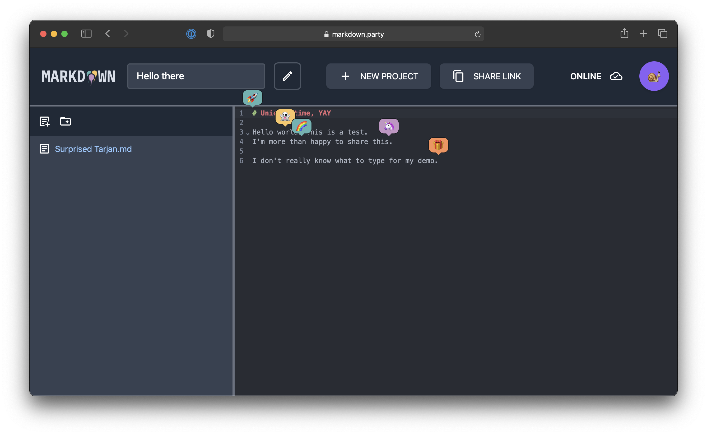

[](
https://opensource.org/licenses/MIT)

[](https://github.com/markdown-party/mono/actions/workflows/frontend.yml)
[](https://github.com/markdown-party/mono/actions/workflows/backend.yml)
[](https://github.com/markdown-party/mono/actions/workflows/tests.yml)

# Welcome to :rainbow: [markdown.party](https://markdown.party/) :rainbow:

`markdown-party/mono` is a distributed collaborative Markdown editor, based on a replicated log of
events. Multiple abstractions are implemented, which replicate events on multiple sites. The project
makes heavy use of [Kotlin coroutines](https://kotlinlang.org/docs/coroutines-guide.html), to allow
non-blocking concurrent communications with many replicas. It implements some tree-like and sequence
CRDTs to replicate its state.



## Library and project walk-through

> Many snippets from the walk-through can be found in the `sample-walkthrough` module. Make sure to
> check them out and run them on your machine, to get a feel of how the library works !

1. [Introduction and basics](library/echo/README.md)
2. [The low-level event log API](library/echo-core/README.md)
3. [Integrations and websockets](library/echo-ktor-websockets/README.md)
4. [Example : adding a move operation for cursors](markdown/markdown/README.md)

## Local setup

This project uses Kotlin 1.5.21 and is built with [Gradle](https://gradle.org). To run the unit
tests locally, please proceed as follows :

```bash
# Clone the repository locally.
> git clone git@github.com:markdown-party/mono.git && cd mono

# Run Gradle tests.
> ./gradlew check

# Run the markdown editor frontend and backend. You'll have to edit the configuration in the
# file "markdown-frontend/src/main/kotlin/main.kt" to point to your localhost rather than the
# production server.
> ./gradlew markdown-backend:run
> ./gradlew markdown-frontend:browserRun
```

## Cheat sheet

Here's how you should use the project :

| Use-case                                                    | Relevant module(s)                               |
|-------------------------------------------------------------|--------------------------------------------------|
| I want to use a Markdown editor.                            | Go to [markdown.party](https://markdown.party) ! |
| I want to replicate Markdown / Trees, but don't want a GUI. | `markdown`, `echo`, (`echo-core`)                |
| I want to create a custom CRDT and replicate it.            | `echo-ktor-xxx`, `echo`, (`echo-core`)           |
| I only need a log of events which computes an aggregate.    | `echo-core`                                      |

## About

I'm developing this project as part of my Bachelor thesis at HEIG-VD. If, like me, you like
distributed systems, Kotlin, coroutines or reactive UI frameworks, I'd love to hear from you
at [alexandre.piveteau@alumni-heig-vd.ch](mailto:alexandre.piveteau@alumni-heig-vd.ch) :v:
