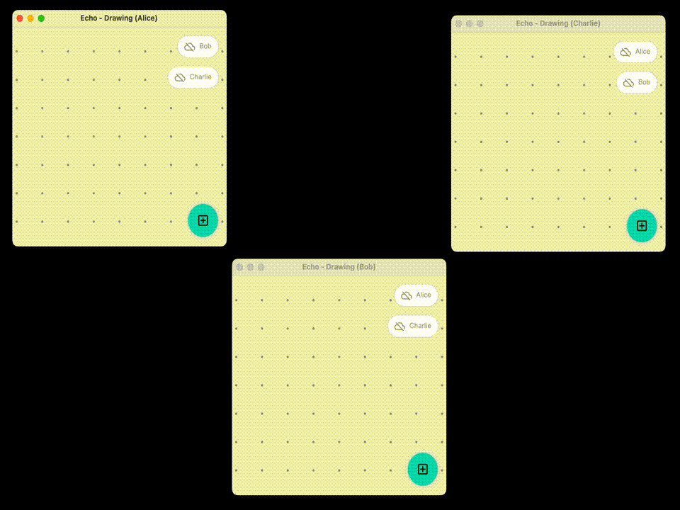

# sample-drawing

- [sample-drawing](#sample-drawing)
  - [Installation](#installation)
  - [How it works](#how-it-works)
    - [User interface](#user-interface)
    - [Data model](#data-model)
  - [Known issues and limitations](#known-issues-and-limitations)

The `sample-drawing` module showcases usage of the `echo` library for a simple collaborative drawing
desktop app. The app lets users create stickers, move them to a random position by clicking them,
change their color and delete them.

The application works in **peer-to-peer**. Peers each have a list of known peers that they can
connect to, and each serve a websocket that will let other sites subscribe to their events.



## Installation

Clone the repository locally, and launch the three clients as follows :

```bash
# Clone the repository.
git clone git@github.com:markdown-party/kotlin-echo.git
cd ./kotlin-echo

# Run each site in a different terminal.
./gradlew sample-drawing:run --args="alice"   # Uses port 8080
./gradlew sample-drawing:run --args="bob"     # Uses port 8081
./gradlew sample-drawing:run --args="charlie" # Uses port 8082
```

This will launch three servers on ports `8080`, `8081` and `8082`.

## How it works

### User interface

The user interface is implemented on top
of [Compose for Desktop](https://github.com/JetBrains/compose-jb). Individual card `@Composable` are
rendered and positioned with various `Modifier.offset {...}`.

Additionally, a list of available sites is displayed on the top right of the screen. Toggling a
site "on" is equivalent to receiving data from it. Because communication is asymmetrical, in order
to get bi-directional communication between two sites, they are required to be toggled "on"
simultaneously.

### Data model

The application defines the
following [events](src/main/kotlin/io/github/alexandrepiveteau/echo/samples/drawing/data/model/DrawingEvent.kt) :

```kotlin
typealias FigureId = EventIdentifier

sealed class DrawingEvent {

    object AddFigure : DrawingEvent()

    data class Move(
        val figure: FigureId,
        val toX: Dp,
        val toY: Dp,
    ) : DrawingEvent()

    data class SetColor(
        val figure: FigureId,
        val color: Color,
    ) : DrawingEvent()

    data class Delete(
        val figure: FigureId,
    ) : DrawingEvent()
}
```

Each figure is uniquely identified by an `EventIdentifier`, which is assigned when an `AddFigure`
event is yielded by a site. Both `Move` and `SetColor` events are applied with LWW semantics, with
concurrent deletions events `Delete` taking precedence over `Move` and `SetColor`.

The events are then aggregated to
a [persistent model data structure](src/main/kotlin/io/github/alexandrepiveteau/echo/samples/drawing/data/model/DrawingBoard.kt)
using a `OneWayProjection` :

```kotlin
object DrawingBoardProjection : OneWayProjection<PersistentDrawingBoard, EventValue<DrawingEvent>> {

    override fun forward(
        body: EventValue<DrawingEvent>,
        model: PersistentDrawingBoard,
    ): PersistentDrawingBoard {

        // Return an updated PersistentDrawingBoard.
        return when (val event = body.value) {
            is DrawingEvent.AddFigure -> model.add(figureId = body.identifier)
            is DrawingEvent.Delete -> model.delete(figure = event.figure)
            is DrawingEvent.Move -> model.move(
                figure = event.figure,
                toX = event.toX,
                toY = event.toY
            )
            is DrawingEvent.SetColor -> model.color(figure = event.figure, color = event.color)
        }
    }
}
```

Because `PersistentDrawingBoard` is backed by some persistent data structures, modifications are
efficiently stored in the event log.

The [events, projection and model are then combined](src/main/kotlin/io/github/alexandrepiveteau/echo/samples/drawing/main.kt)
to create the replicated application state :

```kotlin
// The single source of truth for the local site.
val site =
    mutableSite(
        identifier = SiteIdentifier.random(),
        initial = persistentDrawingBoardOf(),
        projection = DrawingBoardProjection,
    )
```

The state is then modified through standard `event { yield(...) }` calls :

```kotlin
site.event { yield(DrawingEvent.AddFigure) }

// Or
val event =
    DrawingEvent.Move(
        it.id,
        toX = Random.nextInt(from = -144, until = 144).dp,
        toY = Random.nextInt(from = -144, until = 144).dp,
    )
site.event { yield(event) }

// Or
val event =
    DrawingEvent.SetColor(
        it.id,
        color = (FiguresColors - it.color).random(),
    )
site.event { yield(event) }

// Or
val fig: Figure
site.event { yield(DrawingEvent.Delete(fig.id)) }
```

Finally, the state is observed and rendered :

```kotlin
// Observe the figures, and display them.
val figures = site.value.map { it.figures }

figures.collect { figures: List<Figure> ->
    // println(figures)
}
```

## Known issues and limitations

- [[#23]](https://github.com/markdown-party/kotlin-echo/issues/23) The event log is not compacted,
  even though the data model could implement some compaction for LWW operations (such as move and
  color).
- [[#29]](https://github.com/markdown-party/kotlin-echo/issues/29) Disconnecting websockets do not
  cancel the `suspend fun sync()` call, resulting in an inconsistent GUI state for offline sites.
